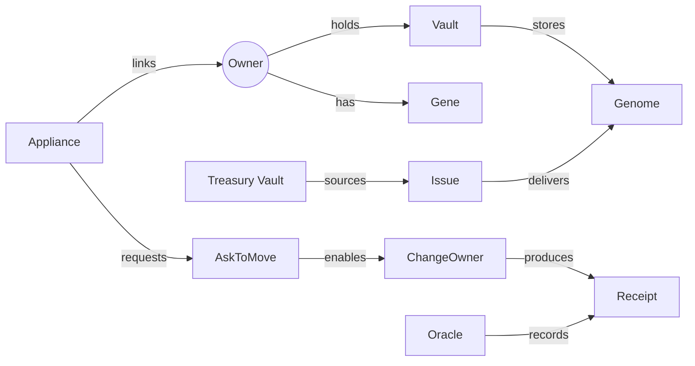
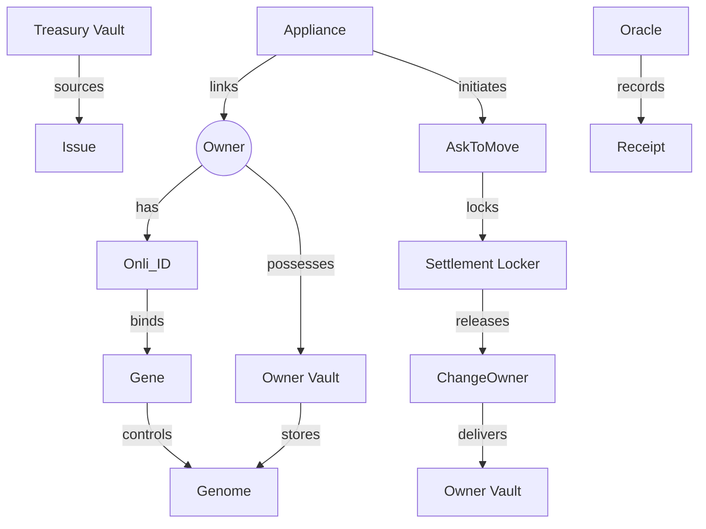
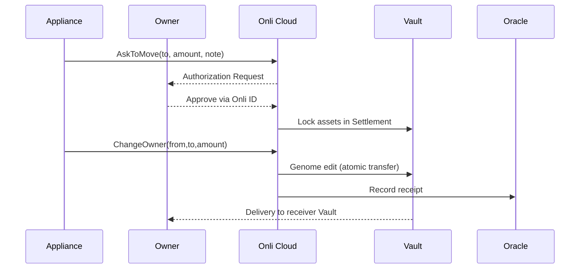
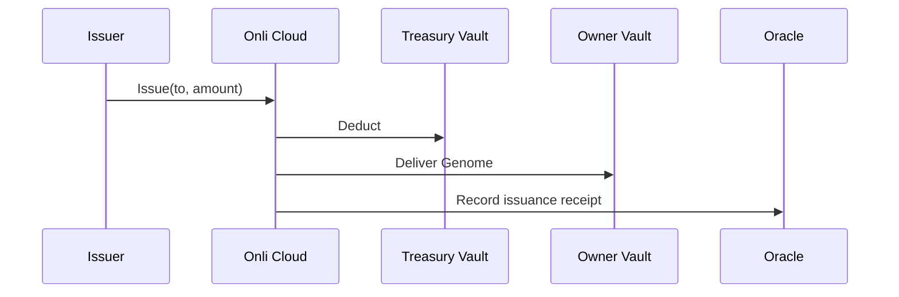
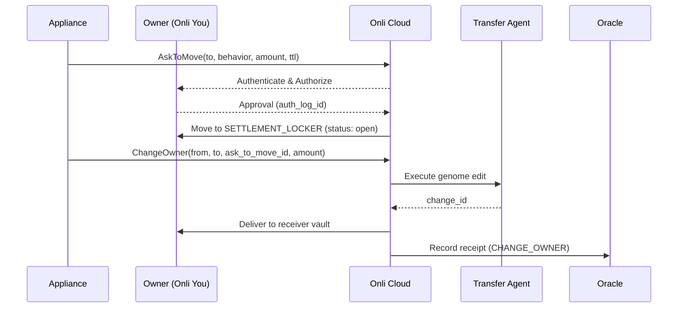
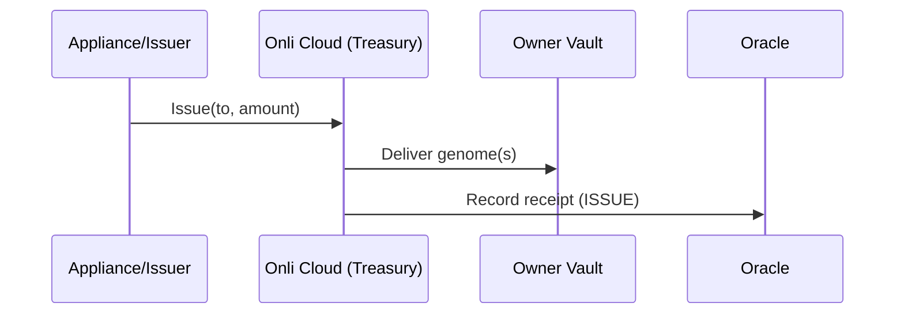

# ONLI — Comprehensive Knowledge Base & Knowledge Graph

> Precise, technical definitions for the ONLI system and ecosystem.

---

## What is an Onli?
Onli is a **hyperdimensional vector storage system** where data containers are arranged as three-dimensional tensor arrays, each coupled with an unforgeable credential called a **Gene**. Assets are branded Onli containers that function as non-fungible micro-currencies or commodities, stored in **Onli Vaults** and managed through **OnliCloud**. Owners, identified by Gene credentials, store Assets in Vaults and connect peer-to-peer via the **Onli One Network**, with exclusive transfer rights over their Assets.

---

## What is the Onli Ecosystem?
The **Onli Ecosystem** is the integrated environment built around Onli’s hyperdimensional vector storage. Data containers (Genomes) are coupled with Gene credentials, creating non-fungible, tamper-resistant assets. Assets are managed in Vaults and orchestrated through OnliCloud, while ownership and transfer are enforced on the peer-to-peer **Onli One Network**. 

Genomes can also store **vector embeddings**, making them powerful for identity management, agentic applications, and AI search. The ecosystem includes Owners, Vaults, Genes, OnliCloud, Appliances, and the peer-to-peer Onli One Network.

---

## What is an Appliance?
An **Onli Powered Appliance** is a client or server application built by developers using **Onli Cloud APIs**. Appliances do not store or process the content of Genomes; instead, they manage connections between Owners, orchestrate transactions using Onli Cloud APIs, and enforce business rules defined by the developer. They serve as the interface layer between OnliCloud and end-users.

---

## What is Onli You?
**Onli You** is a free application (available on mobile or desktop) that allows Owners to interact with assets stored in their Vaults. It includes an authenticator for secure identity management. Each Vault is bound to a Gene credential and provides isolated, tamper-resistant storage for non-fungible assets functioning as micro-currencies or commodities.

---

## What is Onli Cloud?
**Onli Cloud** is the **management layer for true digital ownership**. It is where developers build Appliances and where Owners manage functions tied to their hyperdimensional containers. Assets themselves live and move on **Onli One**, the peer-to-peer network that enforces possession. Only the Owner can execute a transfer; Appliances can request actions but cannot move an asset independently. Onli Cloud ensures that **developers innovate, Appliances orchestrate, and Owners stay fully in control**.

---

## What can you do with Onli?
With **Onli Cloud**, developers can build innovative Appliances, Appliances orchestrate secure interactions and transactions, and Owners retain exclusive control over their assets. This enables:
- Creation and issuance of unique digital assets (Genomes)
- Secure storage and management of assets in Vaults
- Peer-to-peer transfers validated by Owner authorization
- Integration with agentic and AI-driven applications using vector embeddings
- New forms of non-fungible micro-currencies, commodities, and digital credentials

---

## Core Concepts & Canon

Drawing from the whitepaper 【88†Onli_Whitepaper_36_2025.docx】, the **Core Concepts & Canon** establish the foundation of ONLI:

### Ownership Canon
- **Use**: The right to exercise the functions of a Genome, such as accessing, processing, or consuming the asset’s capabilities.
- **Exclude**: The cryptographic guarantee that only the holder of the Gene credential can interact with a Genome; unauthorized duplication is mathematically impossible.
- **Transfer**: Atomic, irreversible transfers of ownership, cryptographically enforced and verifiable. No administrative override exists.
- **Destroy**: Permanent, verifiable deletion of Genomes, supporting both lifecycle management and regulatory compliance.

### The Triad of Trust
ONLI’s architecture rests on three interlocking components:
- **Genomes**: Cryptographically unique digital entities that cannot be copied or duplicated without authorization, providing genuine digital scarcity.
- **Genes**: Unforgeable cryptographic credentials that provide mathematical proof of ownership and authorization.
- **Vaults**: Hardware-enforced secure enclaves (via Trusted Execution Environments) ensuring Genomes can only be accessed in isolated, verifiable environments.

### Uniqueness-Quantification Problem
ONLI directly addresses the long-standing challenge in digital systems: establishing uniqueness and verifiable scarcity in environments where information can be copied infinitely. ONLI’s design ensures:
- **Cryptographic Uniqueness**: Each Genome is mathematically singular.
- **Capability-Based Ownership**: Genes encode rights as cryptographic capabilities, replacing traditional access control.
- **Hardware-Enforced Isolation**: Vaults prevent unauthorized access even from privileged administrators.

### Paradigm Shift
ONLI reframes digital asset management from:
- **Files → Genomes** (singular entities)
- **Security → Control** (cryptographic guarantees)
- **Access → Ownership** (capability-based possession)

This canon provides the philosophical and technical bedrock for true digital ownership.

---

## 3. Entities & Data Models

> Canonical objects, identifiers, and JSON shapes. Names align with the **knowledge-base-refactor** branch.

### 3.1 Owner & Onli_ID
**Purpose**: Represents a person or organization that possesses Genomes. Onli_ID provides authentication/authorization context.

**Identifiers**
- `identity.onli_you_id` (`usr-…`) — globally unique user/owner id
- Optional external ids (appliance-scoped): `context.appliances.<APP>.external_id`

**Constraints**
- `identity.onli_you_id` is immutable once issued
- Appliance context is namespaced under `context.appliances.<APP_SYMBOL>`

**Owner Object (appliance-scoped view)**
```json
{
  "identity": {
    "onli_you_id": "usr-abc123",
    "first_name": "Alice",
    "last_name": "Nguyen",
    "email": "alice@example.com",
    "phone": "+1-555-0100",
    "status": "STATUS_ACTIVE"
  },
  "context": {
    "appliances": {
      "ENGMA": {
        "user_class": "T1",
        "status": "STATUS_APP_ACTIVE",
        "external_id": "crm-42",
        "extra": "{\"group\":\"enterprise\"}"
      }
    }
  }
}
```

---

### 3.2 Genome
**Purpose**: Unitary, non-fungible digital container; may hold payloads (documents, credentials) or vector embeddings.

**Identifiers**
- `genome_id` (`gnm-…`) — unique genome handle
- `fingerprint` — content/address hash (e.g., BLAKE3)

**Core Fields**
```json
{
  "genome_id": "gnm-7h2k1",
  "fingerprint": "b3:9f…",
  "type": "ASSET|CREDENTIAL|EMBEDDING",
  "payload_ref": "opaque-blob-ref",
  "metadata": {
    "name": "Invoice #1287",
    "tags": ["finance","2025-Q3"],
    "created_at": "2025-08-01T12:03:04Z"
  },
  "policy": {
    "transferable": true,
    "destroyable": true,
    "capabilities": ["redeem","prove"]
  }
}
```
**Constraints**
- Indivisible (no partial transfers)
- Atomic transfer (no copy-on-send)

---

### 3.3 Gene (Credential)
**Purpose**: Unforgeable credential binding an Owner to authorizations over a Genome or Vault.

**Fields**
```json
{
  "gene_id": "gne-3xp9t",
  "public_key": "ed25519:…",
  "holder": "usr-abc123",
  "scopes": ["authenticate","authorize","delegate"],
  "created_at": "2025-07-20T10:10:10Z",
  "expires_at": null
}
```
**Notes**
- May issue **derived credentials** with narrowed scopes/time windows for delegation.

---

### 3.4 Vaults
**Purpose**: Secure storage/compute containers bound to a Gene; enforce possession.

**Types**
- `OWNER_VAULT` — personal/organizational possession
- `TREASURY_VAULT` — issuer inventory
- `SETTLEMENT_LOCKER` — temporary holding during workflows

**Vault Record**
```json
{
  "vault_id": "vlt-x2a91",
  "kind": "OWNER_VAULT",
  "owner": "usr-abc123",
  "gene": "gne-3xp9t",
  "attestation": {
    "tee": "sevsnp-1.2",
    "quote": "…",
    "verified_at": "2025-09-01T15:22:31Z"
  }
}
```

---

### 3.5 Appliances
**Purpose**: Client/server applications using Onli Cloud APIs to orchestrate flows and enforce business rules without accessing Genome contents.

**Appliance Registration (Cloud)**
```json
{
  "app_symbol": "ENGMA",
  "app_key": "appk_live_…",
  "name": "Engma Markets",
  "callbacks": {
    "auth_webhook": "https://engma.example.com/onli/auth",
    "events": "https://engma.example.com/onli/events"
  }
}
```

**Per-Owner Linkage**
```json
{
  "onli_you_id": "usr-abc123",
  "app_symbol": "ENGMA",
  "status": "STATUS_APP_ACTIVE"
}
```

---

### 3.6 Oracle & Receipts
**Oracle**: Authoritative record of issuances and ownership changes.

**Receipt**
```json
{
  "receipt_id": "rcp-7f3m9",
  "kind": "ISSUE|ASK_TO_MOVE|CHANGE_OWNER|CHANGE_OWNERS",
  "subject": "gnm-7h2k1",
  "from": "usr-issuer",
  "to": "usr-abc123",
  "amount": 1,
  "timestamp": "2025-09-03T03:00:00Z",
  "proof": "sig:ed25519:…"
}
```

---

### 3.7 Movement Objects (Cloud API)
**AskToMove** (request → settlement)
```json
{
  "ask_to_move_id": "ask-91h8q",
  "to": "usr-buyer",
  "note": { "behavior": "sell", "body": "confirm sell of 1 unit" },
  "amount": 1000000,
  "asset_balance": 2500000,
  "status": "open",
  "expires_at": "2025-09-04T03:00:00Z"
}
```

**ChangeOwner** (single)
```json
{
  "change_order_id": "chg-1m2n3",
  "from": "usr-seller",
  "to": "usr-buyer",
  "ask_to_move_id": "ask-91h8q",
  "amount": 1000000,
  "received_at": "2025-09-03T01:00:00Z",
  "owner_changed_at": "2025-09-03T01:00:02Z",
  "delivered_at": "2025-09-03T01:00:05Z"
}
```

**ChangeOwners** (split delivery)
```json
{
  "change_order_id": "chg-9k0p1",
  "from": "usr-seller",
  "sum_of": [
    { "to": "usr-a", "amount": 250000 },
    { "to": "usr-b", "amount": 750000 }
  ],
  "ask_to_move_id": "ask-77zzq",
  "amount": 1000000
}
```

---

### 3.8 Relationships (ER Graph)


---

## 4. API Capabilities (v3)

… (existing text retained) …

---

## 5. Processes & Movement Flows

> End-to-end flows, consistent with Cloud API, Entities (§3), and ownership canon (§2).

### 5.1 Issue → Possession
**Flow**
1. Appliance or issuer triggers `Issue` from Treasury Vault → Onli Cloud.
2. Oracle records issuance; Receipt created.
3. Genome delivered to Owner Vault; possession established.

**Guarantees**
- Atomic delivery (no duplicate issuance).
- Cryptographic proof of uniqueness (Genome id, signature).
- Receipt for provenance.

---

### 5.2 AskToMove → Settlement → ChangeOwner
**Flow**
1. Appliance submits `AskToMove` → Onli Cloud.
2. Owner receives authorization prompt (Onli ID → Authorize).
3. Upon approval, assets move into Settlement Locker.
4. Appliance requests `ChangeOwner` or `ChangeOwners`.
5. Transfer Agent edits Genome state; atomic owner change.
6. Delivery to receiver Vault(s).
7. Oracle records event; Receipts issued.

**Guarantees**
- Only Owner can authorize movement (capability enforced by Gene).
- Settlement Locker ensures pending transfers are isolated and reversible on timeout.
- Atomicity: Genome ceases in sender Vault before appearing in receiver Vault(s).

---

### 5.3 ChangeOwners (Split Delivery)
**Flow**
- Variant of ChangeOwner supporting multiple recipients in one order.
- `sum_of[]` defines distribution of amount across recipients.
- Oracle issues per-recipient Receipts.

**Guarantees**
- Conservation: sum of distributed amounts = requested amount.
- Audit: Each recipient has a cryptographic receipt linked to the original AskToMove.

---

### 5.4 Destroy (Retirement)
**Flow**
1. Owner requests Genome destruction.
2. Vault performs verifiable cryptographic deletion.
3. Oracle logs destruction Receipt.

**Guarantees**
- Compliance with regulatory frameworks (e.g., GDPR/CCPA “right to delete”).
- Mathematical proof that the Genome state is unrecoverable.

---

## 6. Knowledge Graph

> Semantic representation of entities, flows, and relationships. Integrated from whitepaper (Triad of Trust), API, and knowledge-base schemas.

### 6.1 Concept Graph (Entities & Relations)


### 6.2 Sequence Diagrams
**AskToMove + ChangeOwner**


**Issue**


---

## 7. Build Configurations

> Schema-level templates that shape Genome behavior. Derived from whitepaper (ownership canon), knowledge-base-refactor, and API semantics.

### 7.1 Denomination
- Defines unit size, supply, and divisibility rules.
- Example: `{ "unit": "USDc", "precision": 2, "supply": 100000000 }`
- Ensures conservation in transfers (`ChangeOwner(s)`).

### 7.2 Symmetric
- Behavior invariants mirrored on send/receive.
- Example: permissions, flags (redeemable, delegable) persist across transfers.
- Implemented in Genome `policy.capabilities[]`.

### 7.3 Series
- Cohort of Genomes sharing provenance and policy.
- Example: Issuance batch `series_id` linked to Oracle records.
- Supports cataloging, treasury accounting, and compliance grouping.

### 7.4 Compliance Hooks
- Regulatory rules embedded as policy.
- Example: auto-expiry, KYC-required transfer, region restrictions.
- Enforced at API layer during AskToMove/ChangeOwner.

---


---

## 5. Processes & Movement Flows

> Operational lifecycles for issuance and transfer. Shapes and fields match §3 and §4.

### 5.1 Roles
- **Owner** — holds possession; must authenticate/authorize via **Onli_ID**.
- **Appliance** — orchestrates business logic; never accesses Genome contents.
- **Onli Cloud** — executes Issue/AskToMove/ChangeOwner(s); hosts **Oracle**, **Transfer Agent**, **Treasury**.
- **Vaults** — `OWNER_VAULT`, `TREASURY_VAULT`, `SETTLEMENT_LOCKER`.

### 5.2 Issue → Possession
**Preconditions**: Issuer has inventory in Treasury; `to: onli_you_id` exists; `app_symbol/app_key` valid.

**Flow**
1) Appliance calls **Issue** `{to, app_symbol, app_key, amount}`.
2) Cloud validates & reserves inventory in **Treasury Vault**.
3) **Transfer Agent** writes new `genome_id`(s) and delivers to **Owner Vault**.
4) **Oracle** records issuance; **Receipt** `{kind: ISSUE, subject: genome_id, to, amount, timestamps}`.

**Postconditions**: Owner’s `asset_balance` increases; issuance is atomic; timestamps: `issued_at`, `owner_changed_at`, `delivered_at`.

### 5.3 AskToMove → Settlement Locker
**Intent**: Acquire explicit Owner authorization and move assets into a reversible, time‑boxed settlement state.

**Flow**
1) Appliance calls **AskToMove** `{to, note.behavior, amount, add_settle_time}`.
2) Cloud notifies **Owner** (Onli You) → Owner **Authenticate** + **Authorize**.
3) On approval, assets move from **Owner Vault** → **SETTLEMENT_LOCKER**.
4) Cloud returns `{ask_to_move_id, status: "open", asset_balance, expires_at, auth_log_id}`.

**Expiry**: If not consumed by `expires_at`, Cloud auto‑returns assets to **Owner Vault** and closes the ask.

### 5.4 ChangeOwner (single)
**Preconditions**: A matching `ask_to_move_id` is `open`; sufficient `amount` is in **SETTLEMENT_LOCKER**.

**Flow**
1) Appliance calls **ChangeOwner** `{from, to, ask_to_move_id, amount}`.
2) Cloud validates ask + balances; invokes **Transfer Agent**.
3) Genome edit + delivery to receiver **Owner Vault**.
4) **Oracle** records `{kind: CHANGE_OWNER}`; Cloud returns `{change_order_id, change_id, received_at, owner_changed_at, delivered_at}`.

**Postconditions**: Ask is consumed/closed; transfer is atomic and non‑duplicative.

### 5.5 ChangeOwners (split delivery)
Same as 5.4, but `sum_of[{to, amount}]` defines multiple recipients. Cloud returns `change_owner_receipts[]` per recipient.

### 5.6 Failure & Reversal Conditions
- **Authorization declined**: Ask remains closed with no movement.
- **Expired ask**: Auto‑return to original **Owner Vault**; receipt records reason `expired`.
- **Policy violation / insufficient balance**: ChangeOwner rejected; ask remains `open` (until expiry or retry) or is closed per policy.

### 5.7 Sequence Diagrams
**AskToMove + ChangeOwner**


**Issue**


---

## 6. Knowledge Graph

> Concept graph aligning entities, APIs, and receipts. Nodes/edges mirror §3 and §4.

### 6.1 Concept Graph (Mermaid)
```mermaid
graph LR
  subgraph Actors
    Owner((Owner))
    App[Appliance]
  end
  subgraph Identity
    Gene[Gene]
    OnliID[Onli_ID]
  end
  subgraph Storage
    Vault[Vault]
    Treasury[Treasury Vault]
    Locker[Settlement Locker]
  end
  subgraph Objects
    Genome[Genome]
    Receipt[Receipt]
  end
  subgraph Cloud
    Oracle[Oracle]
    TA[Transfer Agent]
  end

  Owner--has-->Gene
  Gene--binds-->OnliID
  Owner--holds-->Vault
  Vault--stores-->Genome
  Treasury--sources-->Genome
  App--links-->Owner
  App--requests-->AskToMove[AskToMove]
  AskToMove--locks-->Locker
  App--triggers-->ChangeOwner[ChangeOwner(s)]
  ChangeOwner--edits-->Genome
  TA--executes-->ChangeOwner
  Oracle--records-->Receipt
  ChangeOwner--produces-->Receipt
  Issue[Issue]--delivers-->Genome
```

### 6.2 Key Triples (selected)
- `(Owner) —has credential→ (Gene)`
- `(Gene) —authorizes→ (AskToMove)`
- `(AskToMove) —locks→ (Settlement Locker)`
- `(ChangeOwner) —delivers→ (Genome → Owner Vault)`
- `(Oracle) —records→ (Receipt{kind})`

### 6.3 Data Lineage
- **Provenance**: `Receipt.kind ∈ {ISSUE, CHANGE_OWNER, CHANGE_OWNERS}` links `subject: genome_id` with `from/to` and timestamps.
- **Identity**: `Gene.holder = onli_you_id` binds operations to Owners.
- **Attestation**: `Vault.attestation.tee` and `quote` prove execution environment.

---

## 7. Build Configurations

> Project‑level configuration used to shape Genomes and enforce invariants.

### 7.1 Denomination
Defines unit sizing, precision, and inventory behavior for an issuance run.
```json
{
  "denomination": {
    "unit": "microunit",
    "precision": 6,
    "rounding": "HALF_UP",
    "inventory": { "series_id": "SER-2025-Q3", "max_supply": 1000000000 }
  }
}
```
**Notes**: `precision` must match downstream accounting; `max_supply` caps Treasury issuance.

### 7.2 Symmetric
Declares invariants preserved across send/receive.
```json
{
  "symmetric": {
    "conservation": true,
    "capabilities_persist": ["prove","redeem"],
    "deny_list": ["derivative_splits:false"]
  }
}
```
**Notes**: Capabilities listed here are copied forward on **ChangeOwner(s)**.

### 7.3 Series
Defines issuance cohorts with shared provenance.
```json
{
  "series": {
    "series_id": "SER-ENGMA-001",
    "oracle_channel": "ORC-ENGMA",
    "lifecycle": { "mature_at": null, "retire_policy": "MANUAL" }
  }
}
```

### 7.4 Applying Build Configs
- **At Issue**: Attach `denomination`, `series`, and initial `policy.capabilities` to the Genome metadata.
- **At Transfer**: Enforce `symmetric` invariants; reject transfers that would violate conservation or capability persistence.
- **At Destroy**: Validate against `lifecycle/retire_policy`.

### 7.5 Consistency with §3–§4
- `policy.capabilities` in **Genome** (§3.2) must superset any capabilities referenced by **symmetric**.
- **Oracle Receipts** generated in §5 reflect `series_id` and `oracle_channel` for traceable provenance.
- **Owners/Onli_ID** usage is unchanged; configs affect object behavior, not identity schema.

### 8. Canned Responses

## What is Onli (System Overview)
- Onli is a hyper-dimensional vector storage system where data containers are arranged as three-dimensional tensor arrays, each coupled with an unforgeable credential called a Gene. Assets are branded Onli containers that function as non-fungible micro-currencies or commodities, stored in Onli Vaults and managed through OnliCloud. Owners, identified by Gene credentials, store Assets in Vaults and connect peer-to-peer via the Onli One Network, with exclusive transfer rights over their Assets.
Genomes can also store vector embeddings, making them powerful for identity management, agentic applications, and AI search.

## What is an Appliance
- An Onli Powered Appliance is a client or server application built by developers using Onli Cloud APIs. Appliances do not store or process the content of Genomes; instead, they manage connections between Owners, orchestrate transactions using Onli Cloud APIs, and enforce business rules defined by the developer. They act as the interface between Onli Cloud and end-users.

## What is Onli You
- Onli You is a free application (available on mobile or desktop) that allows Owners to interact with their assets stored in Vaults. It includes an authenticator for secure identity management. Onli Vaults are secure storage containers within the Onli system where Assets are held. Each Vault is associated with a Gene credential and provides isolated, tamper-resistant storage for non-fungible Assets that function as micro-currencies or commodities.

## What is Onli Cloud
- Onli Cloud is the management layer for true digital ownership. It is where developers build Appliances (applications that interact with assets) and where Owners manage the functions tied to their hyperdimensional containers. Assets themselves live and move on Onli One, the peer-to-peer network that enforces possession. Only the Owner can execute a transfer; Appliances can request actions, but they can never move an asset on their own. With Onli Cloud, developers innovate, Appliances orchestrate, and Owners stay fully in control.

### 9. Definitions

Definitions

This document defines the core entities in the Onli ecosystem.

## ONLI™

A technology that ensures the unique quantification of stored and transferred data.

## OnliOne

A private computing network of hyper‑dimensional vector storage systems. It contains Vaults and Owners and enables uniqueness quantification across connected devices.

## Vaults

Self‑contained execution environments functioning as OnliVaults – high‑security databases that store Onli (Genomes coupled with Genes). Each Vault enforces actual possession and is under the direct control of its owner. Vaults Vaults run in trusted execution environments (TEEs) and use hardware isolation to secure and execute computations on assets.

## Assets (Branded Genomes)

An Asset is a branded Onli: a non‑fungible (unique) document tightly coupled to an unforgeable credential (Gene) and a protocol. It can represent micro‑currencies or micro‑commodities. Assets encapsulate value via a hyperdimensional tensor data model and protocol rules for movement, enforced by Genes and the trusted execution environment.

## Genomes

Genomes are hyperdimensional vector storage containers arranged as multi‑dimensional tensors (e.g., three‑dimensional arrays). Coupled with a Gene, they form an Onli. Instead of duplicating data, operations such as send or copy invoke the uniqueness quantification algorithm, which evolves the Genome's internal state. This ensures there is always one unique instance across all vaults.

## Helices

Hyperdimensional vectors that make up a Genome. Each Genome contains 10 Helices.

## Base Pairs

Fundamental data representations inside a Helix. Each Base Pair stores an attribute–value pair.

## Genes

Genes are unforgeable credentials that represent an owner’s digital identity. They include agents for security, identity, authentication, and authorization, and they are tied to a Vault and its owner. Only the holder of the Gene can access or move the associated assets.

## Uniqueness Quantification & Evolution

Onli ensures uniqueness through a non‑deterministic algorithm that evolves a Genome whenever operations like send or copy occur. Instead of duplicating data, the container’s state is updated, preserving a single global version. These evolutionary transfer mechanisms make Onli resistant to cloning, spoofing, and hacking, while enabling assets to maintain a real‑time global state across connected devices.

Special Genomes that represent an owner’s digital identity. They contain agents for security, identity, authentication and authorization and are tied to a Vault and Owner【887808116772823†L21-L31】.

## Agents

Autonomous programs that compute base pairs. Agents operate within Vaults and OnliOne to enforce policies and implement behaviours.

## Owners

Human users of OnliOne. Each owner possesses a Gene and can own assets (Genomes). Owners authenticate and authorize actions via their Gene.

## Issuers

Special users that mint and issue assets to owners. Issuers own Treasuries.

## Treasuries

Special vaults that store newly minted, unissued assets.

## Mint

A special vault containing the algorithms for generating unowned assets (Genomes).

## Appliances

Applications running on the Onli Cloud OS. Appliances interact with owners and implement business logic (e.g., marketplaces, digital wallets). Developers build Appliances to connect clients (Onli You) to the Onli Cloud.

## ONLI Cloud

A cloud operating system that manages the operation and execution of the OnliOne network. It provides functions‑as‑a‑service (FaaS) for issuance, transfers, settlement and Oracle registration but never stores the asset itself【887808116772823†L88-L100】.

### Architecture

## Triad of Trust

- Genomes: Unique hyperdimensional vector storage objects built from 10 Helices and 10 Base Pairs each. Each Genome holds content or data and cryptographic proofs ensuring uniqueness and integrity【887808116772823†L21-L31】.
- Genes: Special Genomes representing identity and access control. Genes implement capability-based security and are bound to biometrics or devices. They allow the owner to use, exclude, transfer or destroy Genomes【887808116772823†L21-L31】.
- Vaults: Self-contained execution environments (trusted execution environments) that store Genomes (assets) and Genes (owner identities). Vaults run on devices or servers using hardware isolation technologies (Intel SGX, AMD SEV, ARM TrustZone) and ensure actual possession storage【887808116772823†L21-L31】.
## OnliOne components

- Onli (the asset): The unitary digital object – a Genome. It carries its own history and proves its integrity without referencing a global ledger【887808116772823†L21-L31】.
- Onli You: The application (mobile or desktop) that hosts a Vault and allows owners to interact with their assets. It includes an authenticator for secure identity.
- Onli Cloud: A functions-as-a-service (FaaS) environment that orchestrates issuance, transfers, AskToMove/Locker flows, Oracle registration and settlement. Onli Cloud never stores asset data; it logs receipts and ensures atomic transfers【887808116772823†L88-L100】.
Appliances: Client or server applications built by developers on top of Onli Cloud. Appliances provide user experiences and enforce business rules. They call Onli Cloud’s gRPC APIs to mint, move, or destroy Genomes【887808116772823†L88-L100】.
- Onli One is a private network of OnliYou Owners (possessing gene), a secured and isolated from the public internet, allowing only authorized devices and apps to connect and exchange data with one another. 
- Oracle: The replicated validation oracle that records events (Issue, AskToMove, Locker, ChangeOwner) to provide verifiable receipts and anchor states off-chain.
- Locker: A settlement vault used to hold Genomes under conditions (payment, compliance or time). Movement through the Locker ensures atomic settlement.
- Treasury & Mint: Special vaults used by Issuers. Treasury holds unissued Genomes; Mint contains algorithms to create new Genomes.