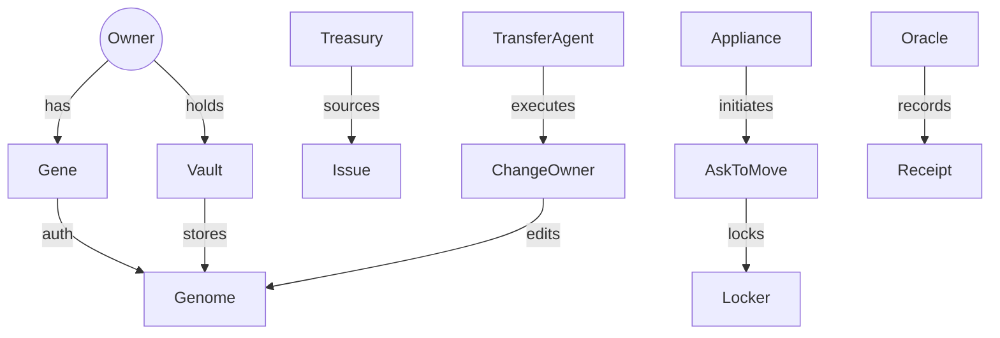
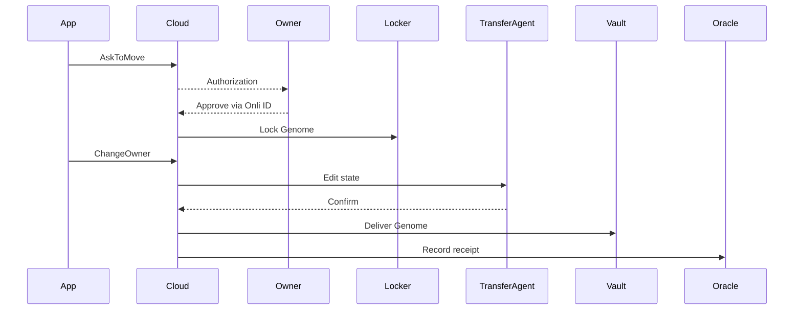

# ONLI KB Condensed

ONLI — Comprehensive Knowledge Base & Knowledge Graph (Outline)
0. Introduction
System overview: Onli as hyperdimensional vector storage.
Clarify triad: Genome (unitary asset), Gene (credential), Vault (storage/possession).
Distinguish from blockchain (possession vs information transfer).
1. Core Concepts & Canon
Ownership Canon (Use, Exclude, Transfer, Destroy).
Triad of Trust: Genome, Gene, Vault.
Uniqueness Quantification: deterministic state evolution.
Paradigm Shift: Files → Genomes, Access → Ownership, Security → Control.
2. Ecosystem & Roles
Onli One (permissioned P2P network).
Onli Cloud (management & API layer, hosts Oracle & Transfer Agent).
Onli You (Owner client app).
Appliances (developer-built apps orchestrating flows).
Owners, Issuers, Transfer Agent, Oracle, Treasury, Settlement Locker.
3. Entities & Data Models
Owner & Onli ID
Genome (unitary, indivisible)
Gene (credential only)
Vaults (Owner, Treasury, Settlement Locker)
Appliances
Oracle & Receipts (canonical receipt kinds: ISSUE, ASK_TO_MOVE, CHANGE_OWNER, CHANGE_OWNERS, DESTROY)
Movement Objects (AskToMove, ChangeOwner, ChangeOwners)
4. API Capabilities (v3)
Core endpoints (Issue, AskToMove, ChangeOwner, ChangeOwners, Destroy).
Standard field casing (snake_case keys, UPPER_SNAKE enums).
Attestation model.
Webhooks/events.
5. Processes & Movement Flows
Issue → Possession
AskToMove → Settlement → ChangeOwner
ChangeOwners (split delivery = multiple Genomes)
Destroy (retirement)
Guarantees (atomicity, exclusivity, conservation, compliance).
6. Knowledge Graph
Concept Graph (mermaid ER of all entities).
Sequence Diagrams (Issue, AskToMove, ChangeOwner).
Key Triples (Owner–Gene, Gene–Genome, etc.).
Data Lineage (provenance, attestation).
7. Build Configurations
Denomination (supply & unit size → many Genomes).
Symmetric (capabilities persist).
Series (issuance cohorts).
Compliance Hooks (policy restrictions).
8. Use Cases
Explain that Onli Corp doesn’t build apps; developers build Appliances.
Map use cases to Appliance patterns: marketplaces, credentials, payments, AI embeddings, compliance records.
9. Definitions (Canonical)
Glossary: Genome, Gene, Vault, Oracle, Receipt, Onli Cloud, Onli One, Onli You, Appliance, Treasury, Settlement Locker, Issuer, Transfer Agent.
All definitions aligned with unitary Genome & credential Gene model.

# ONLI — Comprehensive Knowledge Base & Knowledge Graph

> Canonical rewrite — consistent with unitary Genomes, Gene as credential, and deterministic uniqueness.

---

## 0. Introduction

Onli is a **hyperdimensional vector storage system** for true digital ownership. Unlike blockchains, which transfer information between addresses, Onli transfers **possession** of indivisible digital objects called **Genomes** between Owners. Each Genome is bound to a **Gene** (an unforgeable credential) and stored in a secure **Vault**. Assets are orchestrated through **Onli Cloud** and move across the **Onli One** peer‑to‑peer network. Ownership is exclusive, atomic, and provable without ledgers.

---

## 1. Core Concepts & Canon

### Ownership Canon

* **Use**: exercise functions of a Genome.
* **Exclude**: only the Gene holder can interact with the Genome.
* **Transfer**: atomic, irreversible hand‑off of possession.
* **Destroy**: permanent, verifiable deletion.

### Triad of Trust

* **Genomes**: indivisible, non‑fungible containers.
* **Genes**: unforgeable credentials binding Owners to authorization.
* **Vaults**: TEE‑backed containers ensuring possession.

### Uniqueness Quantification

Deterministic algorithms evolve a Genome’s state at each transfer, producing unpredictable identifiers but maintaining **singularity**. No duplication, spoofing, or cloning is possible.

### Paradigm Shift

* Files → **Genomes**
* Access → **Ownership**
* Security → **Control**

---

## 2. Ecosystem & Roles

* **Onli One**: permissioned peer‑to‑peer overlay; access‑controlled by Cloud enrollment.
* **Onli Cloud**: management and API layer; hosts **Oracle** and **Transfer Agent**.
* **Onli You**: Owner application (mobile/desktop) for Vault access and authentication.
* **Appliances**: developer‑built applications orchestrating flows.
* **Owners**: holders of Vaults and Genes.
* **Issuers**: provision assets from Treasury Vaults.
* **Treasury Vault**: issuer inventory.
* **Settlement Locker**: temporary holding during transfers.
* **Transfer Agent**: edits Genome state during transfers.
* **Oracle**: records Receipts for provenance.

---

## 3. Entities & Data Models

### 3.1 Owner & Onli ID

```json
{
  "identity": {
    "onli_id": "usr-abc123",
    "first_name": "Alice",
    "status": "STATUS_ACTIVE"
  }
}
```

### 3.2 Genome

```json
{
  "genome_id": "gnm-7h2k1",
  "fingerprint": "b3:9f…",
  "type": "ASSET|CREDENTIAL|EMBEDDING",
  "metadata": { "name": "Invoice #1287", "created_at": "2025-08-01T12:03:04Z" },
  "policy": { "transferable": true, "destroyable": true }
}
```

**Constraints**: indivisible; atomic transfers.

### 3.3 Gene (Credential)

```json
{
  "gene_id": "gne-3xp9t",
  "public_key": "ed25519:…",
  "holder": "usr-abc123",
  "scopes": ["authenticate","authorize","delegate"]
}
```

### 3.4 Vaults

Kinds: `OWNER_VAULT`, `TREASURY_VAULT`, `SETTLEMENT_LOCKER`.

```json
{
  "vault_id": "vlt-x2a91",
  "kind": "OWNER_VAULT",
  "owner": "usr-abc123",
  "attestation": { "tee_family": "AMD_SEV_SNP", "verified_at": "2025-09-01T15:22:31Z" }
}
```

### 3.5 Appliances

```json
{
  "app_symbol": "ENGMA",
  "name": "Engma Markets",
  "callbacks": { "events": "https://engma.example.com/onli/events" }
}
```

### 3.6 Oracle & Receipts

Kinds: `ISSUE`, `ASK_TO_MOVE`, `CHANGE_OWNER`, `CHANGE_OWNERS`, `DESTROY`.

```json
{
  "receipt_id": "rcp-7f3m9",
  "kind": "CHANGE_OWNER",
  "subject": "gnm-7h2k1",
  "from": "usr-seller",
  "to": "usr-buyer",
  "timestamp": "2025-09-03T03:00:00Z",
  "proof": "sig:ed25519:…"
}
```

### 3.7 Movement Objects

**AskToMove**

```json
{ "ask_to_move_id": "ask-91h8q", "to": "usr-buyer", "status": "STATUS_OPEN", "expires_at": "2025-09-04T03:00:00Z" }
```

**ChangeOwner**

```json
{ "change_order_id": "chg-1m2n3", "from": "usr-seller", "to": "usr-buyer", "delivered_at": "2025-09-03T01:00:05Z" }
```

**ChangeOwners (split)**

```json
{ "change_order_id": "chg-9k0p1", "from": "usr-seller", "sum_of": [ { "to": "usr-a", "genomes": ["gnm-11aa"] }, { "to": "usr-b", "genomes": ["gnm-22bb"] } ] }
```

---

## 4. API Capabilities (v3)

* **Issue**: deliver new Genomes from Treasury.
* **AskToMove**: request transfer with Owner authorization.
* **ChangeOwner(s)**: complete transfer (single or multiple recipients).
* **Destroy**: retire a Genome.
* **Receipts**: Oracle‑logged proofs.
* All fields in `snake_case`; enums in `UPPER_SNAKE`.

---

## 5. Processes & Movement Flows

### Issue → Possession

1. Appliance calls `Issue`.
2. Treasury Vault supplies Genomes.
3. Delivery to Owner Vault.
4. Oracle logs issuance receipt.

### AskToMove → Settlement → ChangeOwner

1. Appliance submits AskToMove.
2. Owner authorizes via Onli ID.
3. Assets enter Settlement Locker.
4. ChangeOwner(s) executed.
5. Transfer Agent edits Genome state.
6. Oracle records receipts.

### ChangeOwners (Split Delivery)

* Multiple Genomes delivered to multiple recipients.
* Conservation guaranteed.

### Destroy (Retirement)

* Owner requests destruction.
* Vault deletes Genome.
* Oracle records receipt.

---

## 6. Knowledge Graph

### Concept Graph



### Sequence Diagram (AskToMove + ChangeOwner)



---

## 7. Build Configurations

* **Denomination**: defines issuance supply & unit size (many Genomes).
* **Symmetric**: invariants persist across transfers.
* **Series**: issuance cohort with shared provenance.
* **Compliance Hooks**: expiry, region restrictions, KYC rules.

---

## 8. Use Cases

Onli Corporation is a **database company** — it does not build end‑user apps. Developers build **Appliances** on Onli Cloud. Potential uses:

* Marketplaces & exchanges (Appliance orchestrates settlement).
* Credentials & claims (issuance + verification).
* Financial instruments (series‑based Genomes).
* AI embeddings (identity, search, agentic memory).
* Compliance & audit (Receipts as proofs).

---

## 9. Definitions (Canonical)

* **Genome**: unitary, indivisible digital object.
* **Gene**: unforgeable credential.
* **Vault**: secure container (Owner, Treasury, Settlement Locker).
* **Oracle**: Cloud subsystem that records Receipts.
* **Receipt**: proof of an event.
* **Onli One**: permissioned P2P overlay.
* **Onli Cloud**: orchestration layer.
* **Onli You**: Owner client app.
* **Appliance**: developer‑built app.
* **Treasury Vault**: issuer inventory.
* **Settlement Locker**: temporary escrow container.
* **Transfer Agent**: state editor during transfer.
* **Owner**: human or organization holding possession.


Onli Resources
https://onli-support.vercel.app
https://v0-onli.vercel.app